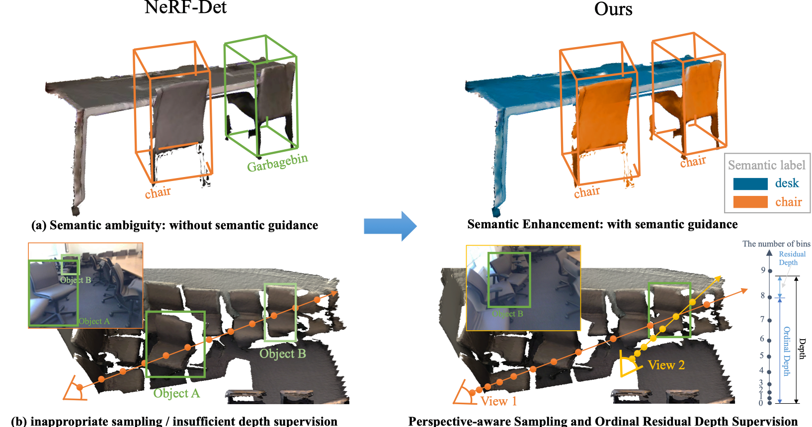
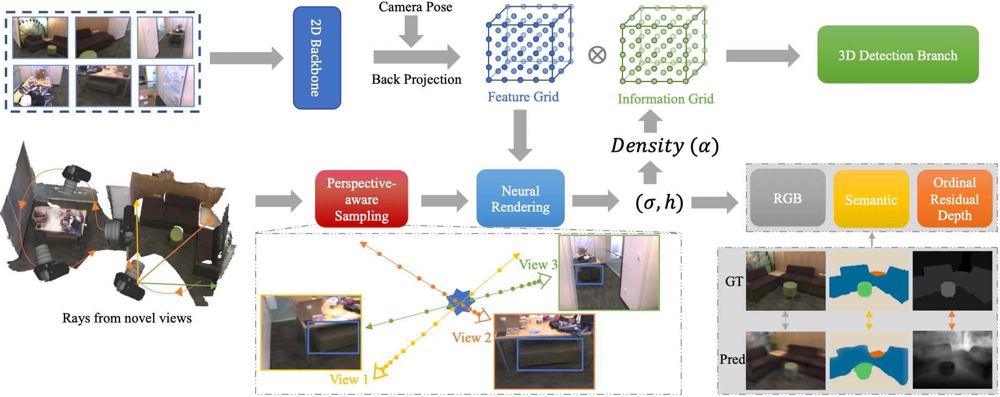

# NeRF-Det++
The official implementation of **NeRF-Det++: Incorporating Semantic Cues and Perspective-aware Depth Supervision for Indoor Multi-View 3D Detection**. The paper is at [this url](http://arxiv.org/abs/2402.14464). The code will be publicly available upon publication.


## Abstract
NeRF-Det has achieved impressive performance in indoor multi-view 3D detection by innovatively utilizing NeRF to enhance representation learning. Despite its notable performance, we uncover three decisive shortcomings in its current design, including **semantic ambiguity**, **inappropriate sampling**, and **insufficient utilization of depth supervision**. To combat the aforementioned problems, we present three corresponding solutions: 1) **Semantic Enhancement**. We project the freely available 3D segmentation annotations onto the 2D plane and leverage the corresponding 2D semantic maps as the supervision signal, significantly enhancing the semantic awareness of multi-view detectors. 2) **Perspective-aware Sampling**. Instead of employing the uniform sampling strategy, we put forward the perspective-aware sampling policy that samples densely near the camera while sparsely in the distance, more effectively collecting the valuable geometric clues. 3) **Ordinal Residual Depth Supervision**. As opposed to directly regressing the depth values that are difficult to optimize, we divide the depth range of each scene into a fixed number of ordinal bins and reformulate the depth prediction as the combination of the classification of depth bins as well as the regression of the residual depth values, thereby benefiting the depth learning process. The resulting algorithm, NeRF-Det++, has exhibited appealing performance in the ScanNetV2 and ARKITScenes datasets. Notably, in ScanNetV2, NeRF-Det++ outperforms the competitive NeRF-Det by **+1.9 % in mAP$@0.25$** and **+3.5 % in mAP$@0.50$**. The code will be publicly at https://github.com/mrsempress/NeRF-Detplusplus.

## Motivation


## Pipeline


## Visualization


## Citation
If you find this project helpful for your research, please consider citing the report and giving a star.
```
@misc{huang2024nerfdet,
      title={NeRF-Det++: Incorporating Semantic Cues and Perspective-aware Depth Supervision for Indoor Multi-View 3D Detection}, 
      author={Chenxi Huang and Yuenan Hou and Weicai Ye and Di Huang and Xiaoshui Huang and Binbin Lin and Deng Cai and Wanli Ouyang},
      year={2024},
      eprint={2402.14464},
      archivePrefix={arXiv},
      primaryClass={cs.CV}
}
```